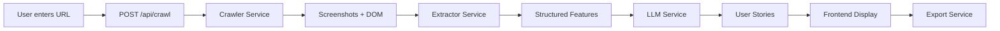

# AIAgent-BA: Website Crawler & User Story Generator

Build a production-grade app that crawls websites, extracts UI/UX features, and generates structured user stories using a local Ollama LLM (Gemma 3:1b).

**Tech Stack**: React 18 + Vite (frontend), Node.js + Express (backend), Playwright (crawling), Ollama (LLM)

---

## Proposed Changes

### Project Structure

```
AIAgent-BA/
├── DesignDocs/           # Existing
├── client/               # React + Vite frontend
│   ├── src/
│   │   ├── components/   # UI components
│   │   ├── services/     # API client
│   │   ├── App.jsx
│   │   └── main.jsx
│   ├── index.html
│   ├── package.json
│   └── vite.config.js
├── server/               # Express backend
│   ├── src/
│   │   ├── routes/       # API routes
│   │   ├── services/     # Business logic
│   │   │   ├── crawlerService.js
│   │   │   ├── extractorService.js
│   │   │   ├── llmService.js
│   │   │   └── exportService.js
│   │   └── index.js      # Express entry
│   ├── data/             # Crawl results storage
│   └── package.json
└── README.md
```

---

### Backend (server/)

#### [NEW] [package.json](file:///c:/Users/SANTOSH/AIAgent-BA/server/package.json)
Express server with dependencies: `express`, `cors`, `playwright`, `uuid`, `docx`, `json2csv`

#### [NEW] [index.js](file:///c:/Users/SANTOSH/AIAgent-BA/server/src/index.js)
Express app with routes, CORS, JSON body parsing, static file serving for screenshots

#### [NEW] [routes/api.js](file:///c:/Users/SANTOSH/AIAgent-BA/server/src/routes/api.js)
REST endpoints:
| Method | Path | Description |
|--------|------|-------------|
| `POST` | `/api/crawl` | Start crawl job (accepts `{ url, maxPages? }`) |
| `GET` | `/api/status/:jobId` | Poll crawl/analysis progress |
| `GET` | `/api/pages/:jobId` | Get crawled pages with extracted features |
| `GET` | `/api/stories/:jobId` | Get generated user stories |
| `POST` | `/api/export` | Export results (JSON/CSV/MD/DOCX) |

#### [NEW] [services/crawlerService.js](file:///c:/Users/SANTOSH/AIAgent-BA/server/src/services/crawlerService.js)
- Playwright-based crawler with queue-based parallel processing
- Discovers internal links, deduplicates URLs, builds sitemap
- Captures screenshots, extracts DOM snapshots
- Handles rate limiting, max depth, loop prevention

#### [NEW] [services/extractorService.js](file:///c:/Users/SANTOSH/AIAgent-BA/server/src/services/extractorService.js)
- Processes DOM snapshots to extract interactive elements (buttons, forms, inputs, modals)
- Identifies navigation structure, content sections, error/empty states
- Returns structured JSON per page

#### [NEW] [services/llmService.js](file:///c:/Users/SANTOSH/AIAgent-BA/server/src/services/llmService.js)
- Ollama HTTP client wrapper (`http://localhost:11434/api/generate`)
- Prompt templating for user story generation
- Token-optimized prompts (Gemma 1B constraint)
- Batch inference with structured JSON output parsing

#### [NEW] [services/exportService.js](file:///c:/Users/SANTOSH/AIAgent-BA/server/src/services/exportService.js)
- JSON, CSV, Markdown, DOCX export formats
- Jira-ready format option

---

### Frontend (client/)

#### [NEW] [package.json](file:///c:/Users/SANTOSH/AIAgent-BA/client/package.json)
Vite + React 18 app with `lucide-react` for icons

#### [NEW] [App.jsx](file:///c:/Users/SANTOSH/AIAgent-BA/client/src/App.jsx)
Main layout with state management, polling logic, and component composition

#### [NEW] Components
| Component | Purpose |
|-----------|---------|
| `UrlInput.jsx` | URL input form with validation + crawl trigger |
| `ProgressTracker.jsx` | Real-time crawl/analysis progress with status indicators |
| `PageList.jsx` | Sitemap view with expandable page details |
| `FeatureViewer.jsx` | Extracted features display per page |
| `StoryPanel.jsx` | Generated user stories grouped by feature area |
| `ExportControls.jsx` | Export format selection + download buttons |

#### [NEW] [services/api.js](file:///c:/Users/SANTOSH/AIAgent-BA/client/src/services/api.js)
API client with `fetch` wrappers for all backend endpoints

#### [NEW] [index.css](file:///c:/Users/SANTOSH/AIAgent-BA/client/src/index.css)
Modern dark theme, glassmorphism cards, smooth animations, responsive layout

---

### Data Flow



---

## User Review Required

> [!IMPORTANT]
> **Ollama must be running locally** with the `gemma3:1b` model pulled before using the LLM features.  
> Run: `ollama pull gemma3:1b` and ensure `ollama serve` is active on port 11434.

> [!NOTE]
> The reference URL (Vercel app) returned a 401, so the UI will be designed based on the Agent.md spec description — clean, modern, with status indicators and expandable sections.

---

## Verification Plan

### Automated Tests
1. **Backend startup**: `cd server && npm install && node src/index.js` — verify server starts on port 3001
2. **Frontend startup**: `cd client && npm install && npm run dev` — verify Vite dev server starts

### Manual Verification
1. Open the app at `http://localhost:5173`
2. Enter a test URL (e.g., `https://example.com`)
3. Click "Start Crawl" and observe progress tracker updates
4. Verify pages appear in the Page List after crawling
5. View extracted features for each page
6. Check generated user stories (requires Ollama running)
7. Test each export format (JSON, CSV, MD, DOCX)
